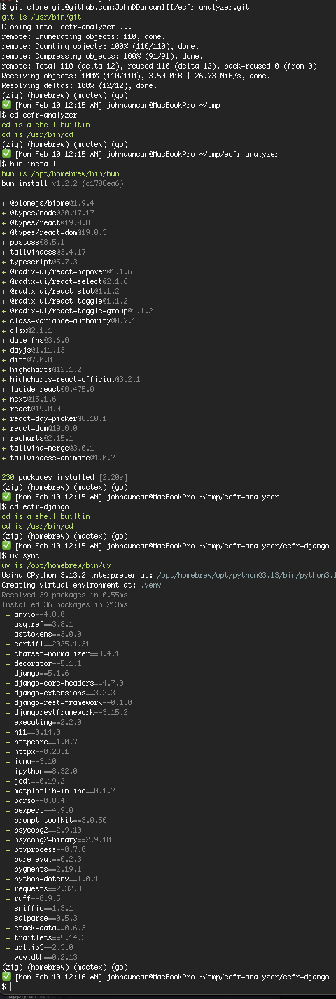
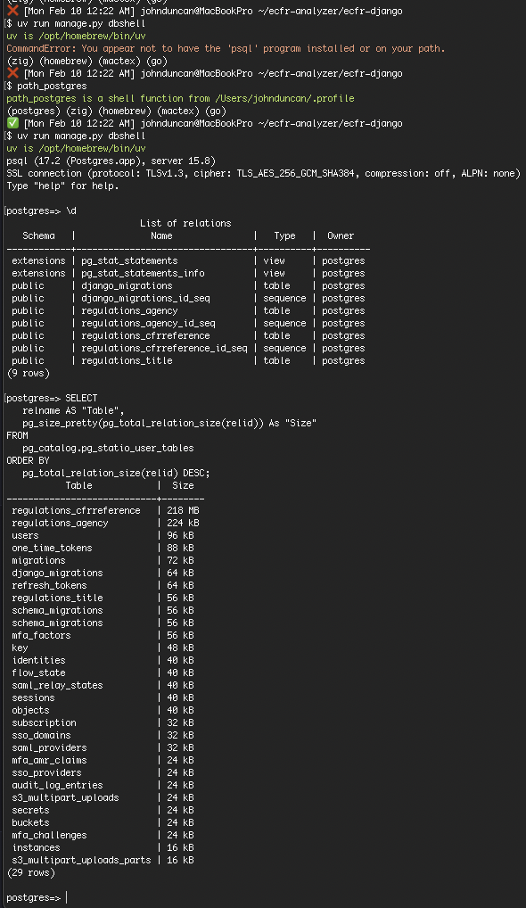
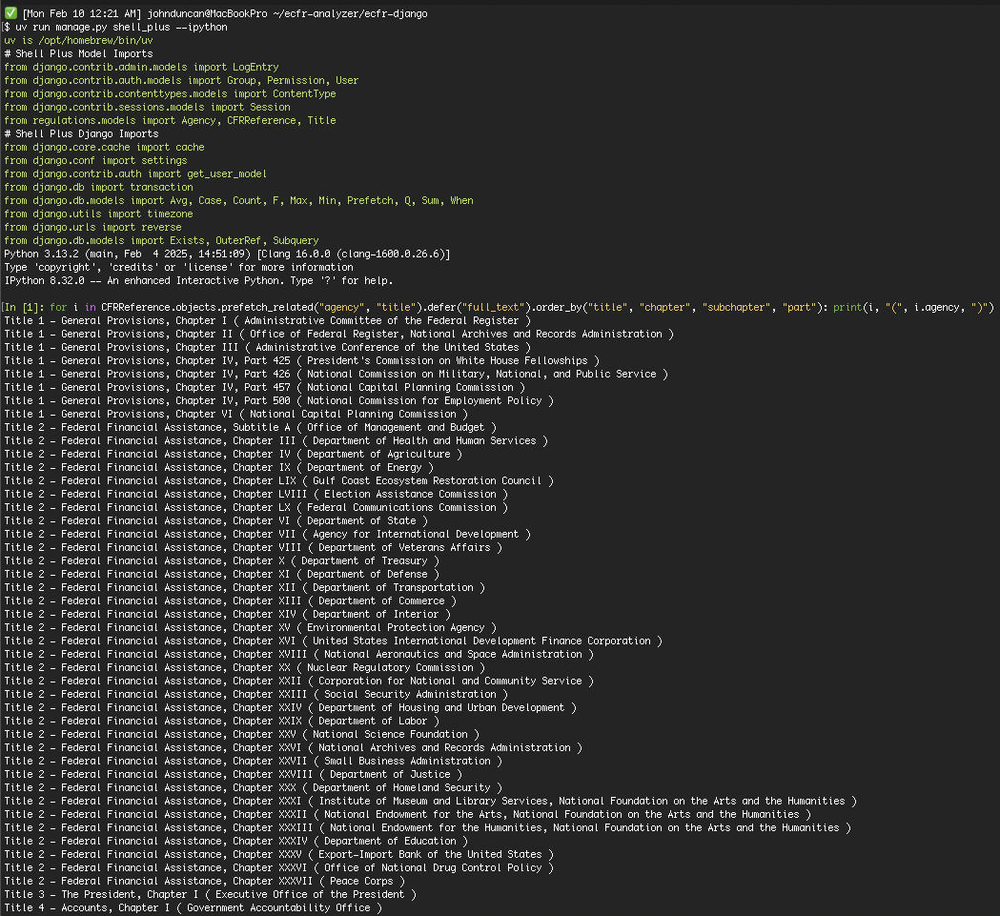
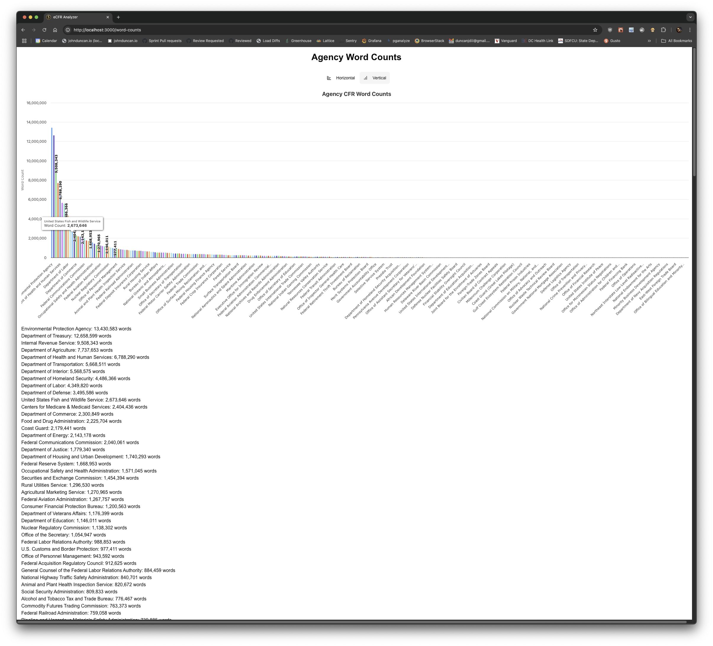
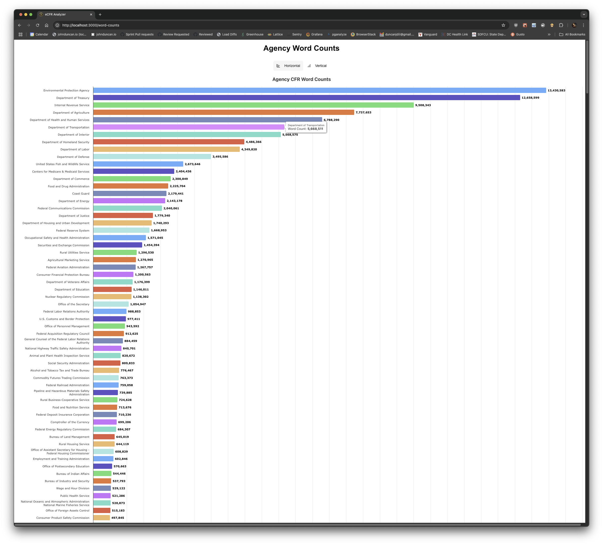
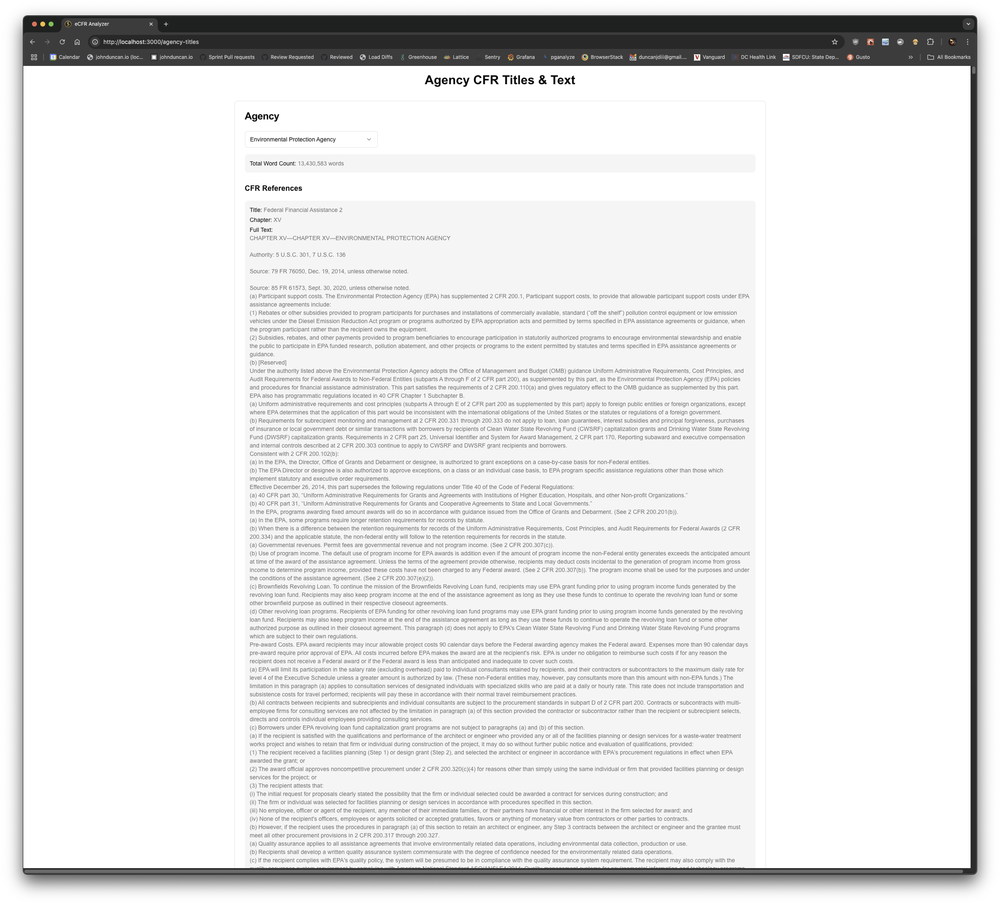
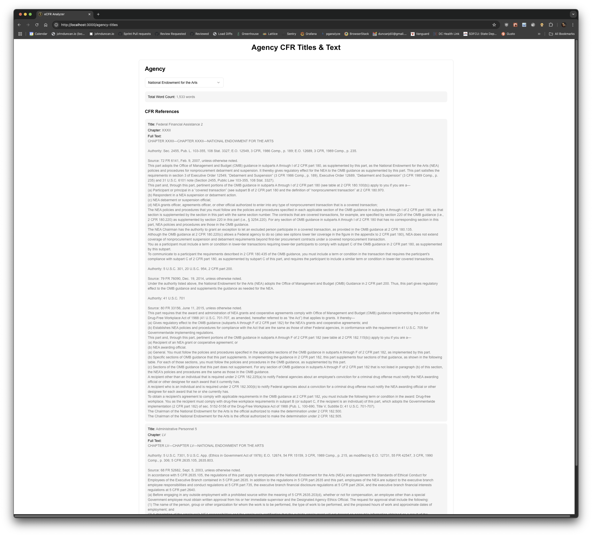
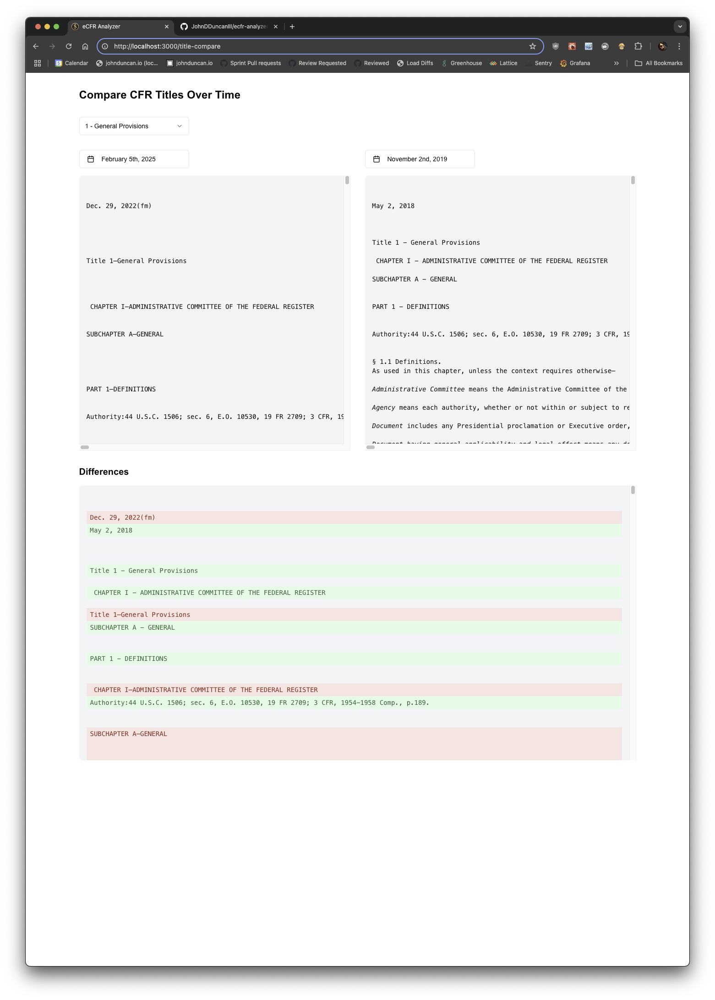
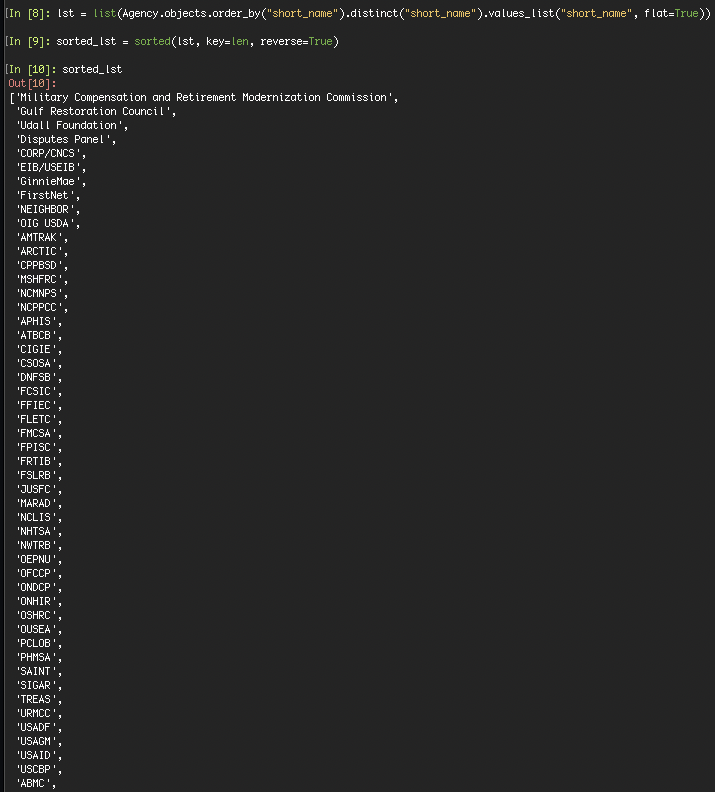
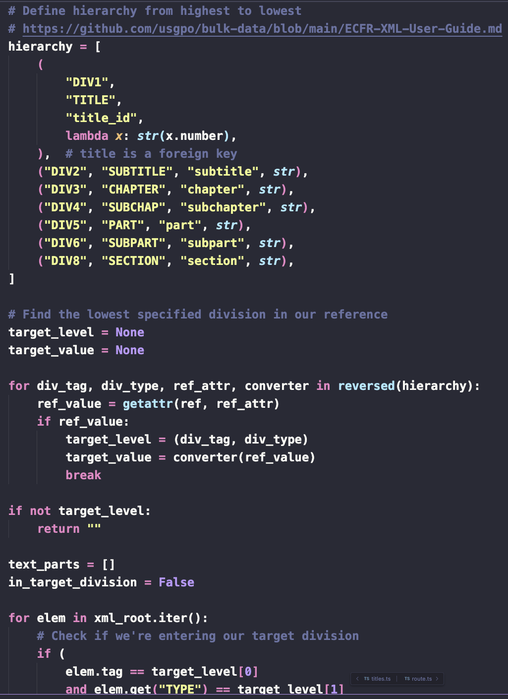

[](https://www.youtube.com/watch?v=uZpB8ZubFzA)

## Getting Started
```bash
$ /bin/bash -c "$(curl -fsSL https://raw.githubusercontent.com/Homebrew/install/HEAD/install.sh)"
$ brew install bun uv biome ruff
$ brew install --cask postgres-unofficial
$ export PATH=/Applications/Postgres.app/Contents/Versions/@latest/bin/:$PATH
$ git clone git@github.com:JohnDDuncanIII/ecfr-analyzer.git
$ bun install
$ cd ecfr-django
$ uv sync
```



## Running the app
### Core
```bash
<new tab>
$ cd ecfr-analyzer
$ bun --bun run dev
<new tab>
$ cd ecfr-analyzer/ecfr-django
$ uv run manage.py runserver
```

Open [http://localhost:3000](http://localhost:3000).


### Optional (dev)
```bash
<new tab>
$ cd ecfr-analyzer/ecfr-django
$ uv run manage.py dbshell
```



```bash
<new tab>
$ cd ecfr-analyzer/ecfr-django
$ uv run manage.py shell_plus --ipython --print-sql
```



### Scripts
```bash
$ uv run manage.py scrape_agencies
$ uv run manage.py scrape_cfr_text --title <title_number> --include-headers (optional)
$ uv run manage.py update_agencies_wordcounts
```

[Agency and Title Scraper](ecfr-django/regulations/management/commands/scrape_agencies.py)

[CFR Full Text Scraper](ecfr-django/regulations/management/commands/scrape_cfr_text.py#L84)

[Update Agencies Wordcounts](ecfr-django/regulations/management/commands/update_agencies_wordcounts.py)

## Functionality
http://localhost:3000/word-counts

[components/ecfr/WordCountDisplay.tsx](components/ecfr/WordCountDisplay.tsx)

[components/ecfr/BarChart.tsx](components/ecfr/BarChart.tsx)





http://localhost:3000/agency-titles
[Agency Titles React Component](app/agency-titles/page.tsx)





http://localhost:3000/title-compare
[Title Compare React Component](app/title-compare/page.tsx)



### Bugs/issues/caveats
#### https://www.ecfr.gov/api/admin/v1/agencies.json
```json
{
	"name": "National Telecommunications and Information Administration",
	...
	"cfr_references": [
		// this no longer exists the ecfr as of 2017-09-20 and was ignored in http://localhost:3000/agency-titles
		// https://www.ecfr.gov/current/title-15/chapter-XXIII
		{
			"title": 15,
			"chapter": "XXIII"
		},
	]
}
```

```json
{
	"name": "Interstate Commerce Commission",
	...
	"cfr_references": [
		// this no longer exists the ecfr as of 2024-12-26 and was ignored in http://localhost:3000/agency-titles 
		// https://www.ecfr.gov/current/title-5/chapter-XL
		{
			"title": 5,
			"chapter": "XL"
		}
	]
}
```

```bash
In [1]: lst = list(Agency.objects.order_by("short_name").distinct("short_name").values_list("short_name", flat=True))
```



```json
{
	"name": "Gulf Coast Ecosystem Restoration Council",
	// this short_name is potentially wrong — should be GCERC
	"short_name": "Gulf Restoration Council",
}
```

```json
{
	"name": "Military Compensation and Retirement Modernization Commission",
	// this short_name is seemingly wrong — should be "MCRMC"
	"short_name": "Military Compensation and Retirement Modernization Commission",
}
```

#### https://www.ecfr.gov/api/versioner/v1/full/{date}/title-{title}.xml
This API endpoint is strange — you would expect it to return truncated XML for queries with a date, title, and subtitle/chapter/subchapter, but even if you include any one of the three aforementionedsubset parameters, the endpoint returns the entire title's XML.

While this is explicitly stated in the API docs, it's not clear to me why the developers decided not to truncate the XML responses if a the subtitle/chapter/subchapter is provided.

I do this work manually in [CFR Text Scraper](ecfr-django/regulations/management/commands/scrape_cfr_text.py#L84).



For example, it's reasonable to assume https://www.ecfr.gov/api/versioner/v1/full/2025-02-06/title-1.xml?chapter=II or https://www.ecfr.gov/api/versioner/v1/full/2025-02-06/title-49.xml?subtitle=A would return the XML for just the chapter, subchapter, or subtitle, but they actually return the entire title's XML.

> Requests can be for entire titles or part level and below. Downloadable XML document is returned for title requests. Processed XML is returned if part, subpart, section, or appendix is requested.

## Deploy
### Backend
https://vercel.com/john-duncans-projects-7bcd2750/ecfr-analyzer/deployments

### Frontend
https://railway.com/project/d565c91c-f0ad-4533-bb36-4c6512b3302d/service/4ca43f63-54a8-4ee7-abbc-351a7a0744f7?environmentId=da119aac-596d-4daf-bb27-1480754f0afa