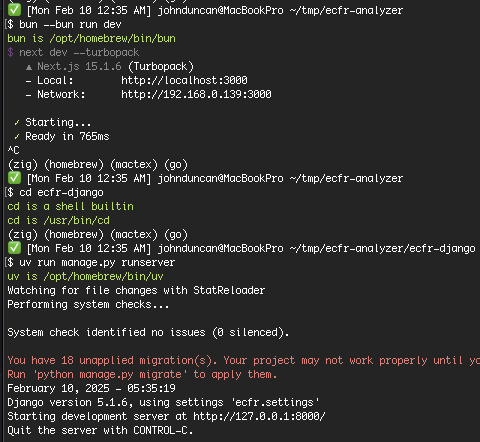

# eCFR Analyzer
An analytics platform that monitors the Electronic Code of Federal Regulations (eCFR), providing real-time insights into regulatory evolution across federal agencies.

[](https://www.youtube.com/watch?v=uZpB8ZubFzA)

## Functionality
### Word Counts
https://ecfr-analyzer-chi.vercel.app/word-counts

http://localhost:3000/word-counts

1. Agency Word Counts: A visualization of word counts across federal agencies, featuring:
	- Interactive bar chart with horizontal/vertical toggle
	- Raw data display option
	- Calculates aggregate word counts for agencies and their subordinate organizations
	- Comprehensive agency hierarchy representation by word count
	- Scrapes agency word counts from the eCFR API versioner endpoint and saves them to the database

[components/ecfr/WordCountDisplay.tsx](components/ecfr/WordCountDisplay.tsx)

[components/ecfr/BarChart.tsx](components/ecfr/BarChart.tsx)


### Agency Titles & Text
https://ecfr-analyzer-chi.vercel.app/agency-titles

http://localhost:3000/agency-titles

2. Agency CFR Titles & Text: An advanced search interface that:
	- Parses complex CFR references (title/subtitle/chapter/subchapter/part/subpart/section) from source XML
	- Displays full text of all related CFR references
	- Leverages scraped data to display agency word counts along with the full text of all related CFR titles

[Agency Titles React Component](app/agency-titles/page.tsx)


### Title Compare/Diff
https://ecfr-analyzer-chi.vercel.app/title-compare

http://localhost:3000/title-compare

3. Historical Title Changes: A comparison tool that:
   - Allows selection of specific titles and date ranges
   - Fetches and parses XML data directly from the eCFR API
   - Provides visual diff analysis of regulatory changes of title between selected dates
   - Displays the full text of the CFR title between the selected dates

[Title Compare React Component](app/title-compare/page.tsx)


## Stack
- Database: [PostgreSQL](https://www.postgresql.org/) in [Supabase](https://supabase.com/)
- Backend: [Django](https://www.djangoproject.com/) REST API
- Frontend: [Next.js](https://nextjs.org/)/React with TypeScript
- Deployment: [Railway](https://railway.com/) (backend) and [Vercel](https://vercel.com/) (frontend)
- Dev: [bun](https://bun.sh/) for next.js, [biomejs](https://biomejs.dev/) for frontend linting, [uv](https://github.com/astral-sh/uv) for python/django, [ruff](https://github.com/astral-sh/ruff) for backend linting
- Visualization: [Highcharts](https://www.highcharts.com/)
- Features efficient data fetching and caching strategies

## Development
### Local
[http://localhost:3000](http://localhost:3000)

### Prod
https://ecfr-analyzer-chi.vercel.app/

## Devops
### Backend
Django REST API [backend](ecfr-django) deployed to https://ecfr-analyzer-production.up.railway.app/api/ through [Railway](https://railway.com/project/d565c91c-f0ad-4533-bb36-4c6512b3302d/service/4ca43f63-54a8-4ee7-abbc-351a7a0744f7?environmentId=da119aac-596d-4daf-bb27-1480754f0afa)

### Frontend
Next.js/React with TypeScript frontend deployed to https://ecfr-analyzer-chi.vercel.app/ through [Vercel](https://vercel.com/john-duncans-projects-7bcd2750/ecfr-analyzer/deployments)

### Database
PostgreSQL database through [Supabase](https://supabase.com/dashboard/project/vcvcjszyjpprefmherxt)

## Getting Started
```bash
$ /bin/bash -c "$(curl -fsSL https://raw.githubusercontent.com/Homebrew/install/HEAD/install.sh)"
$ brew install bun uv biome ruff
$ brew install --cask postgres-unofficial
$ export PATH=/Applications/Postgres.app/Contents/Versions/@latest/bin/:$PATH
$ git clone git@github.com:JohnDDuncanIII/ecfr-analyzer.git
$ bun install
$ cd ecfr-django
$ uv sync
```


## Running the app
### Core
```bash
<new tab>
$ cd ecfr-analyzer
$ bun --bun run dev
<new tab>
$ cd ecfr-analyzer/ecfr-django
$ uv run manage.py runserver
```

Open [http://localhost:3000](http://localhost:3000).



### Optional (dev)
```bash
<new tab>
$ cd ecfr-analyzer/ecfr-django
$ uv run manage.py dbshell
```


```bash
<new tab>
$ cd ecfr-analyzer/ecfr-django
$ uv run manage.py shell_plus --ipython --print-sql
```


### Scripts
```bash
$ uv run manage.py scrape_agencies
$ uv run manage.py scrape_cfr_text --title <title_number> --include-headers (optional)
$ uv run manage.py update_agencies_wordcounts
```

[Agency and Title Scraper](ecfr-django/regulations/management/commands/scrape_agencies.py)

[CFR Full Text Scraper](ecfr-django/regulations/management/commands/scrape_cfr_text.py#L84)

[Update Agencies Wordcounts](ecfr-django/regulations/management/commands/update_agencies_wordcounts.py)

## Bugs/issues/caveats/notes
### https://www.ecfr.gov/api/admin/v1/agencies.json

There are overlapping Title/Chapter cfr_references for the following Agencies:
- Title 40, Chapter VII is shared by:
	- Department of Defense
	- Department of Energy
- Title 47, Chapter II is shared by:
	- National Security Council
	- Office of Science and Technology Policy
- Title 47, Chapter IV is shared by:
	- National Telecommunications and Information Administration
	- National Highway Traffic Safety Administration
- Title 50, Chapter IV is shared by:
	- National Oceanic and Atmospheric Administration
	- United States Fish and Wildlife Service

```json
{
	"name": "National Telecommunications and Information Administration",
	...
	"cfr_references": [
		// this no longer exists the ecfr as of 2017-09-20 and was ignored in http://localhost:3000/agency-titles
		// https://www.ecfr.gov/current/title-15/chapter-XXIII
		{
			"title": 15,
			"chapter": "XXIII"
		},
	]
}
```

```json
{
	"name": "Interstate Commerce Commission",
	...
	"cfr_references": [
		// this no longer exists the ecfr as of 2024-12-26 and was ignored in http://localhost:3000/agency-titles 
		// https://www.ecfr.gov/current/title-5/chapter-XL
		{
			"title": 5,
			"chapter": "XL"
		}
	]
}
```

```bash
In [1]: lst = list(Agency.objects.order_by("short_name").distinct("short_name").values_list("short_name", flat=True))
```


```json
{
	"name": "Gulf Coast Ecosystem Restoration Council",
	// this short_name is potentially wrong — should be GCERC
	"short_name": "Gulf Restoration Council",
}
```

```json
{
	"name": "Military Compensation and Retirement Modernization Commission",
	// this short_name is seemingly wrong — should be "MCRMC"
	"short_name": "Military Compensation and Retirement Modernization Commission",
}
```

### https://www.ecfr.gov/api/versioner/v1/full/{date}/title-{title}.xml
This API endpoint is strange — you would expect it to return truncated XML for queries with a date, title, and subtitle/chapter/subchapter, but even if you include any one of the three aforementionedsubset parameters, the endpoint returns the entire title's XML.

While this is explicitly stated in the API docs, it's not clear to me why the developers decided not to truncate the XML responses if a the subtitle/chapter/subchapter is provided.

I do this work manually in [CFR Text Scraper](ecfr-django/regulations/management/commands/scrape_cfr_text.py#L84).


For example, it's reasonable to assume https://www.ecfr.gov/api/versioner/v1/full/2025-02-06/title-1.xml?chapter=II or https://www.ecfr.gov/api/versioner/v1/full/2025-02-06/title-49.xml?subtitle=A would return the XML for just the chapter, subchapter, or subtitle, but they actually return the entire title's XML.

> Requests can be for entire titles or part level and below. Downloadable XML document is returned for title requests. Processed XML is returned if part, subpart, section, or appendix is requested.
